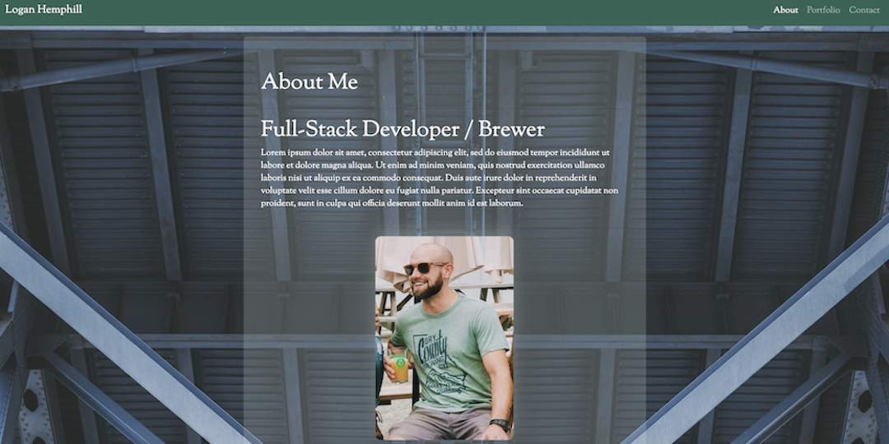

# Unit 02 CSS and Bootstrap Homework

## Responsive Portfolio

</img>

## Features
* "About", "Portfolio" and "Contact" page
* Each page built using Bootstrap 
* Main component of each page is a jumbotron
* Each jumbotron has a grid inside of it and content within that grid
* Portfolio links are dead/placeholder links for now
* Portfolio stacks v ertically in xs viewport
* Each page features a navbar and sticky footer

## Challenges
* Struggled to get navbar to remain fully expanded across all resolutions. I did not want it to collapse.
* Contrast issues with white text against the main background. I added a text-shadow with opacity to help this.
* Used hero-images for the portfolio but found that combining multiple bootstrap elements together can be difficult.
* Found that many bootstrap elements initially resist change to their css styling but it can be forced by adding "!important" to the styling.

### Living Document
This Bio will continue to be updated throughout the beginning of my career with new styling and portfolio content

### To View This
You can visit https://86hemphill.github.io/hw-week2/

### Licensing
The code in this project is licensed under MIT license.

